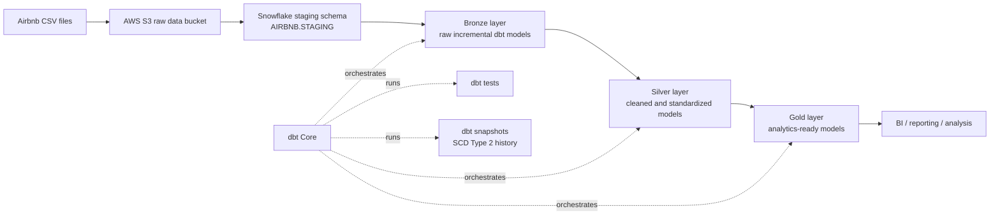
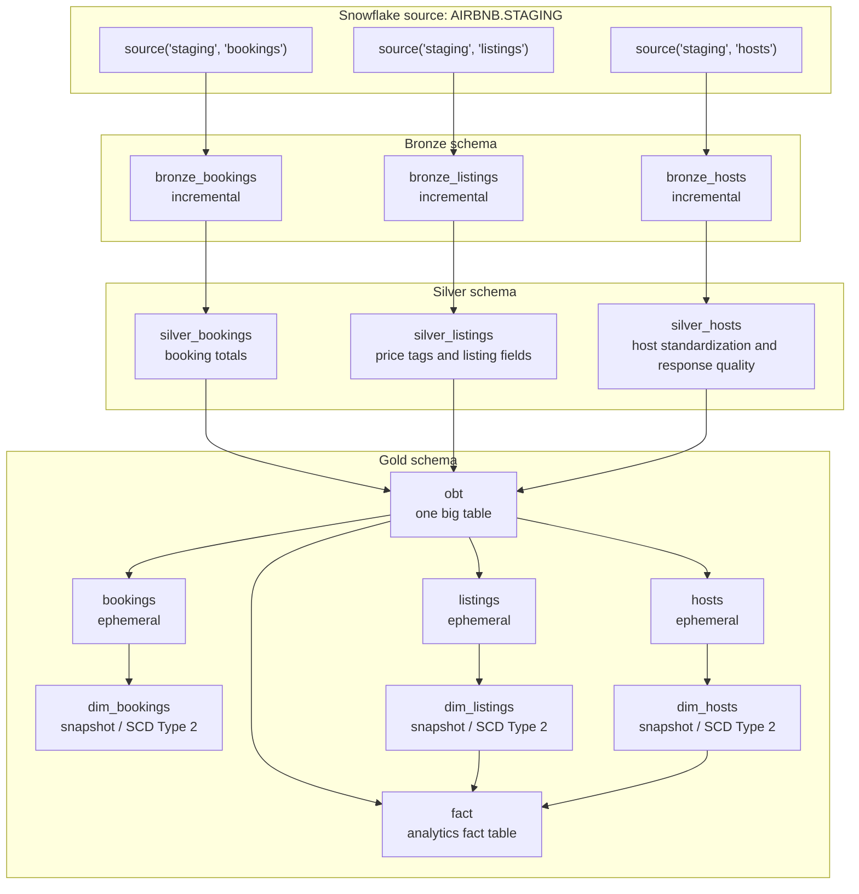
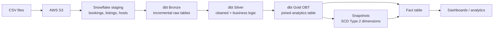

# Airbnb Data Pipeline Diagram

## High-Level Architecture

## dbt Model Lineage

## Layer Responsibilities

| Layer | Objects | Purpose |
| --- | --- | --- |
| Source | `AIRBNB.STAGING.bookings`, `listings`, `hosts` | Landing tables loaded from CSV files after S3/Snowflake ingestion. |
| Bronze | `bronze_bookings`, `bronze_listings`, `bronze_hosts` | Raw incremental copies from the staging source tables using `created_at` filters. |
| Silver | `silver_bookings`, `silver_listings`, `silver_hosts` | Cleaned and enriched tables, including booking totals, listing price tags, host name standardization, and response-rate quality. |
| Gold | `obt`, `fact` | Reporting-ready outputs. `obt` joins bookings, listings, and hosts. `fact` selects analytics columns from the OBT and joins snapshot dimensions. |
| Snapshots | `dim_bookings`, `dim_listings`, `dim_hosts` | SCD Type 2 history using timestamp strategy and `dbt_valid_to_current`. |
| Tests | `source_test.sql` | Warns when staging booking amounts are below the defined threshold. |

## Suggested Presentation Diagram

